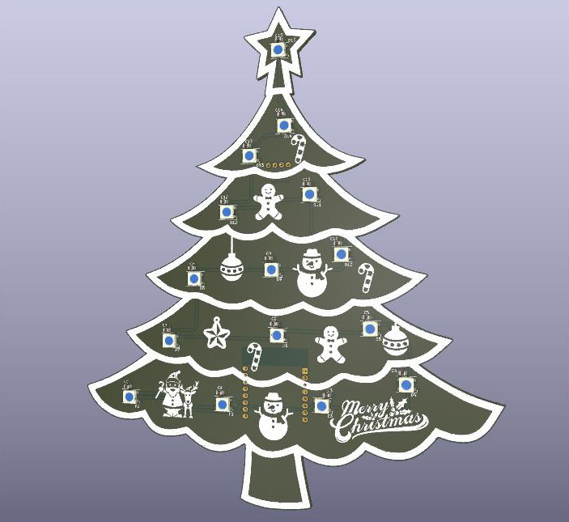
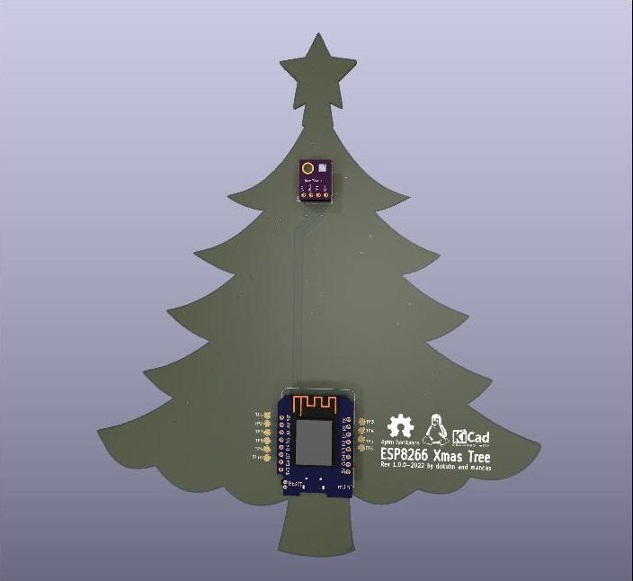

# ESP8266 Xmas Tree

ESP8266 based PCB Xmas tree with WS2812B LEDs as Christmas lights. The Christmas tree can be easily controlled with systems like Tasmota or ESPHome. It is very simple to integrate the Christmas tree into any SmartHome environment. To control the LEDs you can also use the standard development tools for ESP MCUs. To be more flexible, the connection of the MCU and sensor is mounted via female pin header. Components like capacitors are a bit bigger in the footprint to build the Xmas tree without special tools. Only a standard electronic soldering iron and solder is needed. With soldering paste it is a little easier. 

 

## ToDos

- Generate Gerber files
- Fixing EdgeCuts problem to be able to build step file